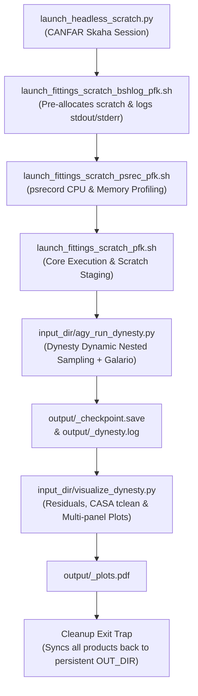

# ALMA Visibility Modelling

> **Bayesian visibility modeling of interferometric radio observations using Dynesty dynamic nested sampling and Galario.**
> 
> *Maintained by Peter Knowlton (University of Victoria)*  
> *Forked and evolved from Emily Carver's ALMA Visibility Modelling repository.*

---

## Table of Contents

- [Scientific Overview](#scientific-overview)
  - [Why Model in the Visibility (Fourier) Domain?](#why-model-in-the-visibility-fourier-domain)
  - [Why Dynamic Nested Sampling (`dynesty`)?](#why-dynamic-nested-sampling-dynesty)
- [Repository History & Context](#repository-history--context)
- [Pipeline Architecture (`dynesty_version`)](#pipeline-architecture-dynesty_version)
  - [Workflow Overview](#workflow-overview)
  - [File & Directory Structure](#file--directory-structure)
- [Software Prerequisites & Environments](#software-prerequisites--environments)
- [How to Run](#how-to-run)
  - [1. Remote Headless Execution (CANFAR Skaha)](#1-remote-headless-execution-canfar-skaha)
- [Output Data Products & Diagnostics](#output-data-products--diagnostics)
- [AI-Assisted Development](#ai-assisted-development)

---

## Scientific Overview

### Why Model in the Visibility (Fourier) Domain?

Radio and millimeter interferometers like the **Atacama Large Millimeter/submillimeter Array (ALMA)** do not directly capture sky images. Instead, antenna pairs cross-correlate incoming electromagnetic wavefronts to sample spatial Fourier frequencies $(u, v)$ of the true sky brightness distribution. These Fourier measurements are called **complex visibilities**:

$$V(u, v) = \iint I(x, y) \, e^{-2\pi i (ux + vy)} \, dx \, dy$$

Traditional methods reconstruct sky images through Fourier inversion and deconvolution algorithms (such as `CLEAN`). However, incomplete $(u, v)$ coverage, non-linear deconvolution steps, and spatially correlated noise can introduce systematic artifacts and biased parameter measurements.

**Visibility modeling** bypasses image deconvolution altogether:
1. Proposes a parametric 2D physical brightness model $I(x, y; \theta)$.
2. Computes the model Fourier transform $V_{\text{mod}}(u, v; \theta)$ using **[Galario](https://github.com/mtazzari/galario)** (GPU/CPU-accelerated library).
3. Evaluates the goodness-of-fit $\chi^2$ directly against the calibrated visibility table $(u, v, \text{Re}, \text{Im}, w)$:

$$\chi^2(\theta) = \sum_k w_k \left| V_{\text{obs}}(u_k, v_k) - V_{\text{mod}}(u_k, v_k; \theta) \right|^2$$

$$\ln \mathcal{L}(\theta) = -\frac{1}{2} \chi^2(\theta)$$

### Why Dynamic Nested Sampling (`dynesty`)?

Previous versions of this pipeline relied on Markov Chain Monte Carlo (MCMC) via `emcee`. This version uses **Dynamic Nested Sampling** with **[dynesty](https://dynesty.readthedocs.io/)**:
- **Bayesian Evidence ($\mathcal{Z}$)**: Calculates the marginal likelihood $\mathcal{Z} = \int \mathcal{L}(\theta)\pi(\theta)d\theta$, enabling quantitative Bayesian model selection (e.g. evaluating whether a 19-parameter 3-blob model is statistically justified over a 7-parameter smooth ring).
- **Multi-modal Posterior Exploration**: Efficiently navigates complex, degenerate, or multi-peaked parameter landscapes without getting trapped in local minima.
- **Dynamic Live Point Allocation**: Dynamically allocates live points to regions of high posterior mass or complex topology, ensuring high-fidelity credible intervals ($\text{median} \pm 1\sigma$).

---

## Repository History & Context

- **Emily Carver's Original Repository**: Provided the initial groundwork for ALMA visibility modeling using MCMC sampling.
- **MCMC Archive (`emcee_version/`)**: Contains the historical MCMC implementation based on `emcee`.
- **Current Dynamic Nested Sampling Version (`dynesty_version/`)**: Redesigned to utilize `dynesty` nested sampling, multi-core multiprocessing pools, node-local scratch staging, resource profiling, and integrated CASA residual imaging.

---

## Pipeline Architecture (`dynesty_version`)

The `dynesty_version/` directory contains an end-to-end distributed workflow designed for high-performance batch execution on the **CANFAR** (Canadian Advanced Network for Astronomical Research) cloud infrastructurs.

### Workflow Overview



### File & Directory Structure

```
dynesty_version/
├── launch_headless_scratch.py              # Python launcher for CANFAR Skaha batch sessions
├── launch_fittings_scratch_bshlog_pfk.sh   # Logging wrapper: captures live stdout/stderr to bashlog.txt
├── launch_fittings_scratch_psrec_pfk.sh    # Profiler wrapper: tracks CPU/RAM usage with psrecord
├── launch_fittings_scratch_pfk.sh          # Core shell runner: scratch staging, Conda activation & cleanup
└── input_dir/                              # Code and model definitions executed on compute node
    ├── agy_run_dynesty.py                  # Main Dynesty sampling driver with multiprocessing Pool
    ├── model_prof.py                       # 2D parametric brightness models & Galario interface
    ├── prior_tform.py                      # Unit hypercube prior transformations for Dynesty
    └── visualize_dynesty.py                # Post-fit imaging, CASA tclean, and PDF figure generation
```

## Software Prerequisites & Environments

The pipeline uses two Python environments to balance dependency constraints (e.g. CANFAR `skaha` requires Python $\ge 3.9$, while certain legacy versions of `galario` and `CASA` tools require Python $\le 3.8$):

### 1. Launcher Environment (Python $\ge 3.9$)
Used by `launch_headless_scratch.py` on client machines or CANFAR login nodes:
- `canfar` / `skaha`
- `numpy`
- `pandas`

### 2. Execution Environment (`pk_env_38` / Python $\le 3.8$)
Used inside the compute containers / batch jobs:
- **`dynesty`** ($\ge 2.0$)
- **`galario`** (GPU or multi-core CPU build)
- **`casatools` & `casatasks`** (Modular CASA for `tclean`, `impbcor`, `table`)
- **`astropy`** (FITS handling, WCS coordinates, Cutout2D)
- **`matplotlib` & `corner`** (Plotting and visualization)
- **`psrecord` & `psutil`** (System resource monitoring)
- **`scipy` & `numpy`**

---

## How to Run

### 1. Remote Headless Execution (CANFAR Skaha)

To spawn a remote batch session on CANFAR:

```bash
# Syntax: python launch_headless_scratch.py <session_name> <fittype>
python launch_headless_scratch.py ngc3351-gaussring-01 twod_gaussring
```

This launches a headless container with 16 CPU cores, executes the full pipeline in node-local scratch space, and outputs results to `/arc/home/<user>/dynest_product_dir/<session_name>/`.

---

## Output Data Products & Diagnostics

Upon completion, the output directory contains:

| Output Product | Description |
| :--- | :--- |
| `<fittype>_checkpoint.save` | Serialized Dynesty sampler state containing all nested samples, weights, and evidence estimates. |
| `<fittype>_dynesty.log` | Text log containing live sampling progression, Bayesian log-evidence $\ln \mathcal{Z} \pm \sigma$, sampling efficiency, and parameter quantiles (16th, 50th, 84th percentiles). |
| `<fittype>_plots.pdf` | Multipage PDF report containing:<br>• **Page 1**: Dynesty summary run plot (live points, evidence convergence, sample weights).<br>• **Page 2**: Posterior corner plot with 1D parameter marginals and 2D covariance contours.<br>• **Page 3**: 3-panel comparison (Observed CLEAN image, Model sky intensity, CLEAN residual visibilities) in $\text{MJy}/\text{sr}$.<br>• **Page 4**: 3-panel comparison with model contour overlays. |
| `<name>_psrecord.png` & `.txt` | Resource monitoring profile tracking CPU % and memory (MB) utilization over the duration of the run. |
| `bashlog.txt` | Complete stdout and stderr log captured during the execution of all shell and Python stages. |

---

## AI-Assisted Development

This repository has been updated and structured with the assistance of **Google Antigravity**.
